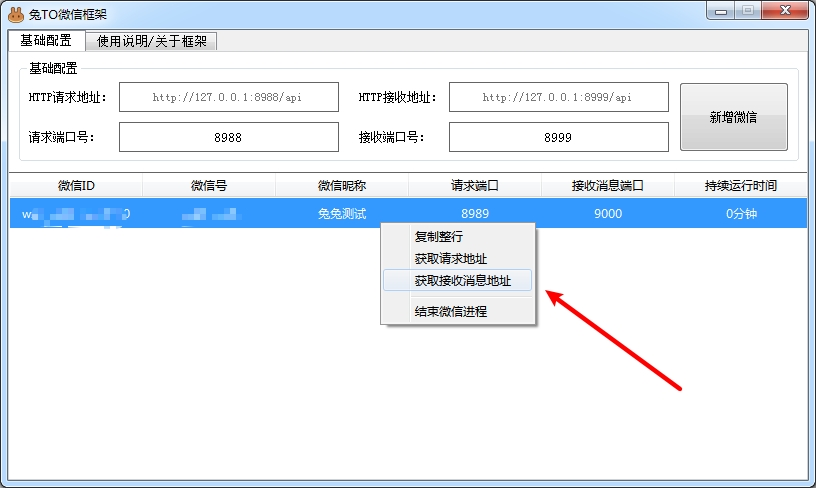

### 本框架仅支持3.6.0.18版本的微信，可加交流QQ群（[685818242](https://qm.qq.com/cgi-bin/qm/qr?k=YcBdRmPqog1Ua6e5hw9vrldZ6sIeefRk&jump_from=webapi&authKey=UoFt17Z79PhEs5FURDT0dT3o9qoeFkpf2U9+rql/2a+pg7/6c4PeD4JeJDEMqrMt&group_code=685818242)）下载官方安装包

### 本框架不收取任何费用，完全免费，仅供测试、学习，请勿用于商业用途、违法内容等

### 

- 稳定、超长待机！！！
- 求Star、求Star、求Star

## 使用教程

- 设置请求端口号（后续你就可以通过这个端口号发送HTTP请求来发送聊天消息）
- 设置接收端口号（后续你就可以启动一个HTTP服务来接收聊天消息）
- 点击 [新增微信] 按钮，会启动微信客户端，正常登录即可

- 复制请求地址
- 向请求地址发送POST请求，参数为JSON，具体参数请看文档

- 复制接收消息地址
- 搭建一个HTTP服务，让框架能POST请求到这个地址即可

